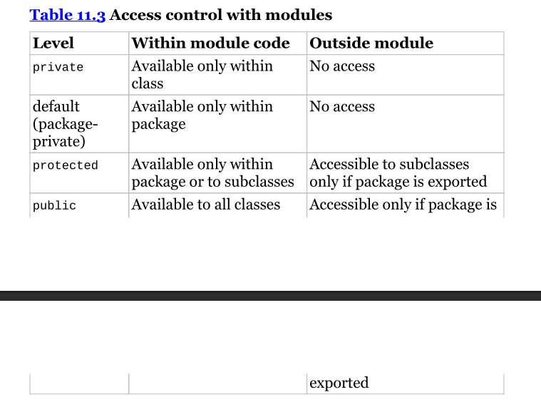

## Java Modules
JPMS stands for Java Platform Module System. It includes the following:

1. A format for module JAR files.
2. Partitioning of the JDK into modules.
3. Additional command-line options for java tools.

## What is a module in java?
A module is simply a group of one or more packages with a special file module-info.java.

## Why are modules used?
- Better access control: Modules are used to control access to package from others meaning you can restrict a certain package from accessing a class from another package thanks to modules.

- Clearer Dependency Management: Modules can also be used to manage dependencies and it uses the module-info.java file to add these dependencies.

- Custom Java Builds: The jlink command in Java is used to create a custom runtime image, also known as a modular runtime image or a custom JRE (Java Runtime Environment). It is available starting from Java 9.

- Improved Performance: Since we are adding just the required modules our program needs to run it improves the startup time for big programs and requires less memory to run.

- Unique package Enforcement: This simply means that when using modules we can't have the problem of having two packages having the same name which might cause some sort of conflicts at runtime.

## Creating and Running a modular program.
After writing your java code, to be able to create an run it as a modular program you can follow the steps below:

1. Compiling our first module
Before we can run modular code, we need to compile it. To do so we can use the command below:

```java
javac --module-path mods -d feeding chapter/zoo/animal/feeding/*.java module-info.java 
```
Breakdown of the command:
- javac: is use to compile the code.
- --module-path: specifies the directory where we can find modules dependencies in our case it is the mods directory.
- -d: specifies the directory we want to store the compiled classes or files.
- module-info.java: This file represents the module declaration for java modules and it consist of the module name and its dependencies.

Alternative ways of compiling the code.

- javac -p mods -d feeding chapter/zoo/animal/feeding/*.java module-info.java
- javac -p mods -d feeding chapter/zoo/animal/feeding/Task.java module-info.java

Now that we are done compiling our module we can run it using the command below:
```java
java --module-path feeding --module chapter.zoo.animal.feeding/chapter.zoo.animal.feeding.Task
```
Since we already saw that the option --module-path can be replaced with -p then an alternative way of running the program is using the following command:
```java
java -p feeding --module chapter.zoo.animal.feeding/chapter.zoo.animal.feeding.Task
```
## Command options and abbreviations for the java and javac command you need to know for the exam.
<br>
command     option     abbreviation<br><hr>
javac  |    -d         |no abbreviation<br>
       | --module-path |      -p<br>
java   |   --module    |   -m<br>
       | --module-path |     -p

## Packaging our first module.
To package our module we can make use of the command below:
```java
jar -cvf mods/chapter.zoo.animal.feeding.jar -C feeding/ .
``` 

If you want to add a version for your module you can use the option --module-version while packaging the module then pass the module version.

Now that we have package our module let's run it using the command below:
```java
java -p mods -m chapter.zoo.animal.feeding/chapter.zoo.animal.feeding.Task
``` OR
```java
java --module-path mods --module chapter.zoo.animal.feeding/chapter.zoo.animal.feeding.Task
```

For a module to be used or called by others we need to export that module in the module-info.java file and this is done using the keyword exports. Example:
```java (module-info.java)
module chapter.zoo.animal.feeding{
    exports chapter.zoo.animal.feeding;
}
```
After doing this if you already package this module then you will need to compile and package it back using the javac and jar commands respectively as seen above.

## Diving into the module-info file.
Now that we have successfully created modules, we can learn more about the module-info file. While we were creating modules we saw some keywords used in the module-info file like the exports, requires, uses, provides and opens. 

Note: When we were looking at keywords the above mentioned keywords were not among that's simply because java sees these words as a keyword only in the module-info file and does not consider it in java classes, interfaces etc. 

These special keywords in the module-info file are called <b>directives.</b>

1. exports: it is used to export packages so that other modules can use them. If you want to export a package to a specific module you can use the exampe below:
```java
module my.module{
    // exporting package my.packagea so that module my.modulea can use
    exports my.packagea to my.modulea;
    // export package my.packageb so that all modules can use
    exports my.packageb;
}
```


Note: when working with modules if you don't export a package even if the classes in that package are public no module will have access same for the members of the classes.

2. requires: the requires keyword is use to define dependencies. for example if i have two modules a and b and a depends on b then in my module-info file of module a i will have this as content.
```java
module a{
    // define dependency between a and b
    requires b;
    // if i want other modules to use a i will use the following
    exports a;
}
```

Note: when working with requires keyword, you can't require a package two times in thesame module-info file. for example the code below will not compile.
```java
module chapter.zoo.animal.care {
    exports chapter.zoo.animal.care.medical;
    // duplicate requires for a single package.
    requires chapter.zoo.animal.feeding;
    requires transitive chapter.zoo.animal.feeding;
}
```

3. provides: the provides keyword specifies that a class provides an implementation of a service. we will talk more about this on the 1z0-816 guide.

4. opens: this keyword is used for reflection that's inspecting and calling codes at runtime.

## how to get information about a module.
To get information concerning a given module you can make use of the java command as shown below:
```java
java -p mods -d chapter.zoo.animal.feeding 
// OR
java --module-path mods --describe-module chapter.zoo.animal.feeding
```

Note: when working with modules you can get informaion concerning a given module using the command ```java -p <path-to-find-module> -d <module name>```. this command outputs information concerning the module but also adds an additional information which is a module that is required by all modules and this module is called <b>java.base mandated</b>. So the module java.base mandated is like the java.lang package that is automatically fed up into classes when working with java.

Another remark when you use the above command is that when you export a package for a specific module to use it adds a new word qualified infront of the exports keyword.

Now let's say in a module you have two packages and you export jst a single package in that module when you use the above command it will include that there is a package in that module you didn't export and to recognise this package it is marked with the keyword contains.

## Listing modules.
If you want to list modules that comes with java you can use the command below:
```java
java --list-modules
```
The above command displays all the modules that came with java and each module is follwed by an "@" character then the java version you are using on your system.

If you want to list the built-in modules plus the once you created you can simply use the command below:
```java
java -p <path-to-find-modules> --list-modules 
```

To get more info on the modules you can use the command below:
```java
java --show-module-resolution -p <path-to-find-modules> -m <module-name>/<package_name>.<class-to-execute>
```
Note: The above command start by listing the module we requested then give more info on that module then run the program.

## The jar command.
Like the java command we can also describe modules using the jar command as follows:
```java
jar -f <path-to-find-modules> -d or jar --file <path-to-find-modules> --describe-module
```

## The jdeps command.
This command gives us information about the dependencies within a module. Example:
```java
jdeps -s <path-to-find-modules> or
jdeps -summary <path-to-find-module>
```
Note: You can use jdeps to get the dependencies of a module without the -s or -summary option to get the output in a long format.

If you want to get the dependencies of a module that requires a dependency that is not offered by java then you will either pass the dependent module first followed by the the actual module that depends on the previous you just passed or you will directly specify where to find the dependency. The commands are as follows:

- First case:
```java
jdeps -s <path-to-parent-module> <path-to-child-module> 
// usage
jdeps -s mods/chapter.zoo.animal.feeding.jar mods/chapter.zoo.animal.care.jar
```
Note: like we earlier said you can remove the option -s and it will just give you the output in long format.

- Second case:
```java
jdeps -s --module-path <path-to-find-module> <relative-path-to-module>
// usage
jdeps -s --module-path mods mods/chapter.zoo.animal.care.jar
```
Note: If you replace the --module-path with -p it won't work because jdeps uses -p option for another purpose.

## The jmod command.
Oracle recommend using JAR files for most modules but since there are some files that cannot be added to a JAR in such a situation the JMOD files are used instead of JAR files. So JMOD is used when working with JMOD files. Below are some modes you can use when dealing with the jmod command.

1. create: create a JMOD file.
2. extract: extract all files from a JMOD (works like unzip).
3. describe: prints the module details such as requires.
4. list: list all the files in the JMOD file.
5. hash: shows a long string that goes with the file.
